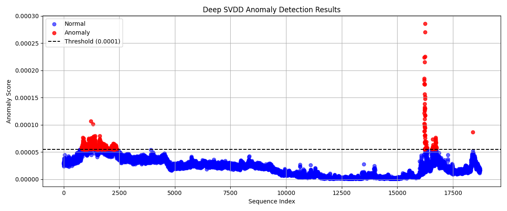
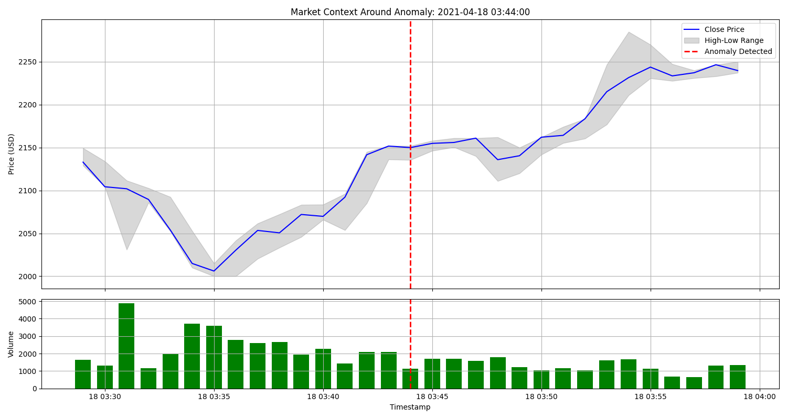
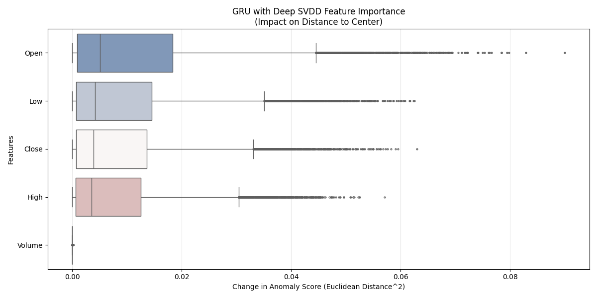
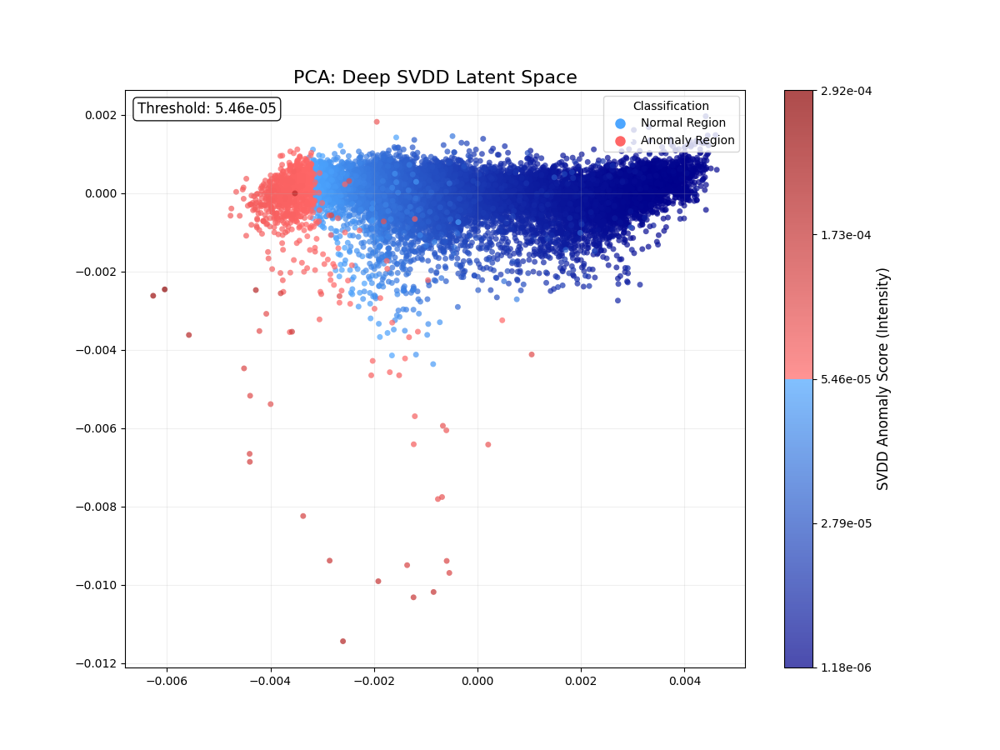
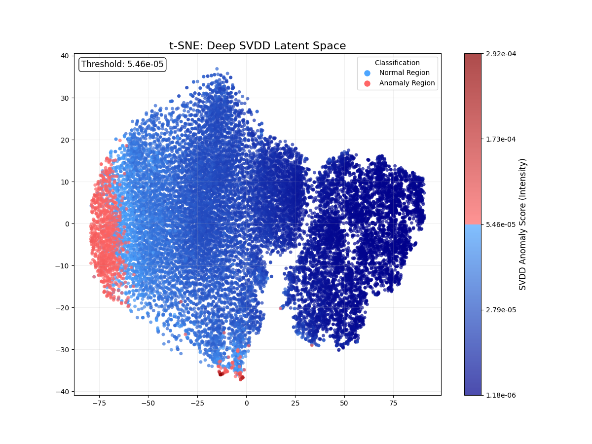

# GRU-with-Deep-SVDD-Loss-for-Anomaly-Detection-in-Cryptocurrencies
For a detailed description of the model, refer to the Level 2 Analysis section.

## Train the model
To train the model, execute the `utils/train.py` script. Configuration parameters can be adjusted in the `utils/config.py` file.

## Test the model
To test the model, run the `utils/runner.py` script. Ensure that the trained models are available in the `models` directory. Configuration parameters for testing can also be modified in the `utils/config.py` file.

## Results
### Anomalies on Test Set

### Example Market Context on Test Set

### Feature Importance

### PCA Visualization

### t-SNE Visualization
